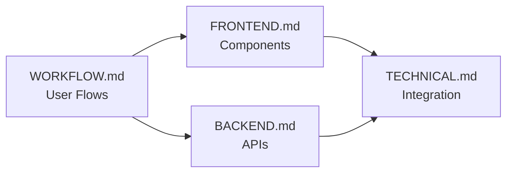

# ROAST - AI Skincare Companion
## Documentation Index

> **Version**: 1.0 MVP

---

# 📁 Documentation Structure

```
docs/
├── WORKFLOW.md      # User flows, screens, interactions
├── UI.md            # Design system, style, components
├── FRONTEND.md      # React/Lovable implementation
├── BACKEND.md       # Supabase + Cloudflare Workers
└── TECHNICAL.md     # Architecture & integration
```

---

# 🚀 Quick Start

## For Designers
→ Start with [WORKFLOW.md](./docs/WORKFLOW.md) to understand user journeys and screen layouts.

## For Frontend Developers
→ Read [FRONTEND.md](./docs/FRONTEND.md) for React components and design system.

## For Backend Developers
→ Check [BACKEND.md](./docs/BACKEND.md) for Supabase schema and Cloudflare Workers.

## For Tech Leads
→ Review [TECHNICAL.md](./docs/TECHNICAL.md) for system architecture and integration patterns.

---

# 🎯 MVP Scope

## Core Features (MVP)
| Feature | Priority | Document |
|---------|----------|----------|
| Onboarding Quiz | P0 | WORKFLOW.md |
| User Authentication | P0 | BACKEND.md |
| AI Skin Scan | P0 | WORKFLOW.md, BACKEND.md |
| Dashboard | P0 | WORKFLOW.md, FRONTEND.md |
| AM/PM Routines | P1 | WORKFLOW.md |
| Progress Photos | P1 | WORKFLOW.md |
| Subscription Gates | P1 | FRONTEND.md, BACKEND.md |

## Post-MVP Features
- Ingredient Scanner
- ROASTChat AI Coach
- Challenges & Gamification
- PDF Reports
- Social Sharing

---

# 🏗️ Tech Stack

| Layer | Technology | Free Tier |
|-------|------------|-----------|
| **Web App** | React (Lovable) | ✅ Free |
| **Mobile** | Flutter WebView | ✅ Free |
| **Database** | Supabase PostgreSQL | 500MB |
| **Auth** | Supabase Auth | Unlimited |
| **Storage** | Supabase Storage | 1GB |
| **AI Workers** | Cloudflare Workers | 100K req/day |
| **Payments (Web)** | Stripe | Pay as you go |
| **Payments (Mobile)** | RevenueCat | Free up to 2.5K MTR |

---

# 📋 Setup Instructions

1. **Supabase Project**
   - Create project at [supabase.com](https://supabase.com)
   - Run migrations from `supabase/migrations/`
   - Enable Google & Apple OAuth

2. **Cloudflare Workers**
   - Deploy workers from `workers/`
   - Set secrets via Wrangler CLI

3. **Web App**
   - Import to Lovable or run locally
   - Configure environment variables

4. **Mobile App**
   - Build Flutter wrapper
   - Configure RevenueCat

See [SETUP.md](./SETUP.md) for detailed instructions.

---

# 📊 Document Cross-References



| Topic | Primary Doc | Related Docs |
|-------|-------------|--------------|
| Onboarding screens | WORKFLOW | FRONTEND |
| Scan flow | WORKFLOW | BACKEND, TECHNICAL |
| Database schema | BACKEND | TECHNICAL |
| React components | FRONTEND | WORKFLOW |
| API integration | TECHNICAL | BACKEND, FRONTEND |
| State management | FRONTEND | TECHNICAL |
| Cloudflare Workers | BACKEND | TECHNICAL |
| Flutter bridge | TECHNICAL | FRONTEND |

---

# ✅ Document Status

| Document | Status | Last Updated |
|----------|--------|--------------|
| WORKFLOW.md | ✅ Complete | 2026-01-02 |
| FRONTEND.md | ✅ Complete | 2026-01-02 |
| BACKEND.md | ✅ Complete | 2026-01-02 |
| TECHNICAL.md | ✅ Complete | 2026-01-02 |
