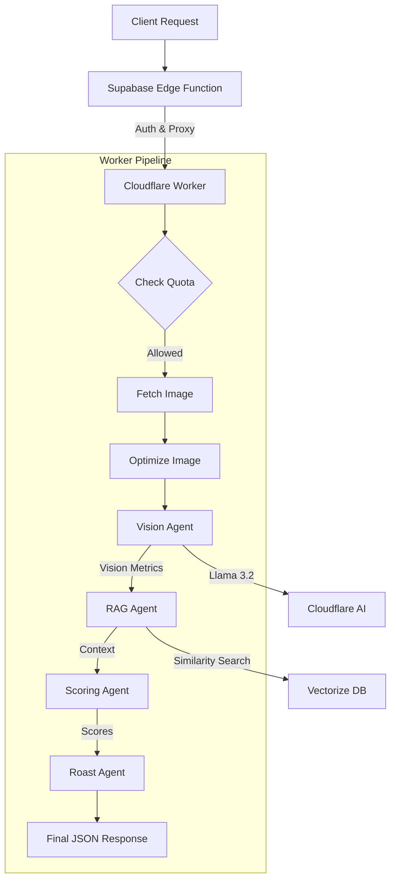

# Skin Analysis Worker Architecture

This document details the architecture and implementation of the AI Skin Analysis system running on Cloudflare Workers.

## Overview

The Skin Analysis Worker (`workers/skin-analyzer`) is a serverless application that acts as the "brain" of the ROAST AI Skincare Companion. It processes user selfies to extract dermatological metrics, generates scores, and provides personalized "roasts" and recommendations.

## Tech Stack

- **Platform**: Cloudflare Workers
- **AI Model**: Llama 3.2 11B Vision Instruct (`@cf/meta/llama-3.2-11b-vision-instruct`)
- **Vector Database**: Cloudflare Vectorize (for RAG)
- **Caching**: Cloudflare KV
- **Language**: TypeScript

## Analysis Pipeline

The worker executes a multi-stage pipeline for each request:



### 1. Vision Agent (`vision-agent.ts`)
- **Role**: Analyzes the visual features of the face.
- **Model**: `@cf/meta/llama-3.2-11b-vision-instruct`
- **Output**: JSON object with scores (0-100) for:
    - **Pores**: Visibility and size.
    - **Texture**: Smoothness and imperfections.
    - **Tone**: Uniformity and pigmentation.
    - **Hydration**: Visual signs of moisture/dryness.
- **Key Implementation Details**:
    - **Prompt Engineering**: The prompt is strictly tuned to allow "perfect" scores (90-100) for healthy skin to avoid artificial down-ranking.
    - **Robust Parsing**: Includes logic to extract JSON from mixed-text responses (handling markdown blocks).
    - **Error Handling**: Throws explicit errors on failure (no fallback mock data) to ensure transparency.

### 2. RAG Agent (`rag-agent.ts`)
- **Role**: Retrieves dermatological knowledge based on the vision metrics.
- **Mechanism**:
    - Converts vision low-scores (e.g., "oily skin") into vector embeddings.
    - Queries the `skincare-knowledge` Vectorize index.
    - Returns relevant condition descriptions and product ingredients.

### 3. Scoring Agent (`scoring-agent.ts`)
- **Role**: meaningful synthesis of raw AI data.
- **Mechanism**: Calculates a weighted "Glow Score" based on the 4 sub-metrics.

### 4. Roast Agent (`roast-agent.ts`)
- **Role**: Personality generation.
- **Mechanism**: Uses the vision data + RAG context to generate a witty, sarcastic, or encouraging comment ("The Roast").

## API Reference

### Endpoint
`POST https://skin-analyzer.ai-skincare.workers.dev`

### Authentication
Header: `Authorization: Bearer <WORKER_SECRET>`

### Request Body
```json
{
  "image_url": "https://supabase.../image.jpg",
  "user_id": "uuid-string",
  "scan_id": "uuid-string"
}
```

### Response Body
```json
{
  "glow_score": 85,
  "analysis_summary": {
    "hydration": { "score": 78, "severity": "mild", "description": "..." },
    "texture": { "score": 88, "severity": "minimal", "description": "..." },
    ...
  },
  "roast_message": "Your skin is glowing...",
  "recommendations": ["..."],
  "product_suggestions": ["..."],
  "processing_time_ms": 1234
}
```

## Setup & Deployment

See `workers/skin-analyzer/README.md` for detailed commands.

### Key Deployment Commands
```bash
# Deploy to production
npx wrangler deploy

# Tail logs
npx wrangler tail
```

### Common Issues
- **License Error**: If you see `5016: Prior to using this model...`, you must accept the license agreement. This is typically done via the Cloudflare Dashboard or by a one-time prompt submission.
- **JSON Parse Error**: usually means the AI model outputted conversational text instead of strict JSON. The `vision-agent.ts` has specific regex logic to handle this, but extreme cases might still fail.
