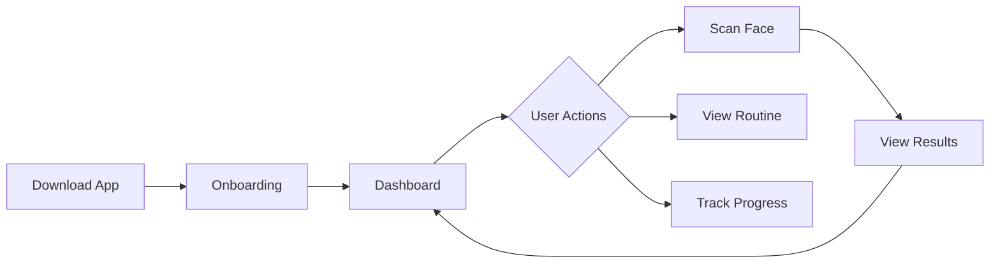
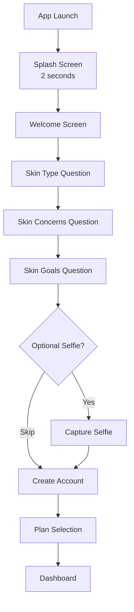
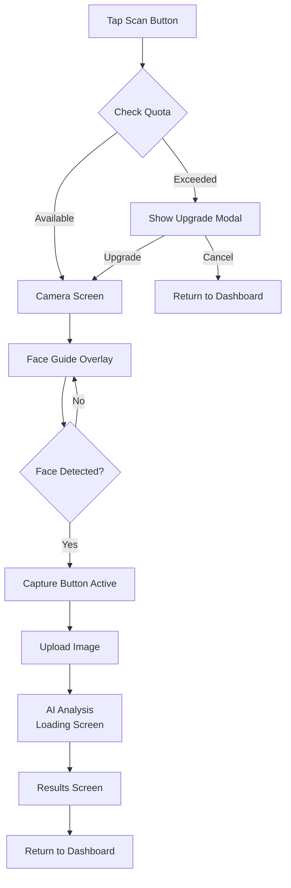

# ROAST - Workflow Specification
## User Flows & Screen Interactions

> **Version**: 1.0 MVP  
> **Last Updated**: 2026-01-02

---

# 1. App Overview

## 1.1 Core User Journey



## 1.2 MVP Feature Scope

| Feature | MVP | Post-MVP |
|---------|-----|----------|
| Onboarding Quiz | ✅ | - |
| Account Creation | ✅ | - |
| Dashboard | ✅ | - |
| AI Face Scan | ✅ | - |
| Scan Results | ✅ | - |
| AM/PM Routines | ✅ | - |
| Progress Photos | ✅ | - |
| Ingredient Scanner | ❌ | ✅ |
| ROASTChat AI Coach | ❌ | ✅ |
| Challenges/Gamification | ❌ | ✅ |
| PDF Reports | ❌ | ✅ |

---

# 2. Onboarding Flow

## 2.1 Flow Diagram



## 2.2 Screen Specifications

### Screen 1: Splash
| Property | Value |
|----------|-------|
| Duration | 2 seconds |
| Content | ROAST logo + tagline |
| Animation | Fade in/out |
| Next | Welcome Screen |

### Screen 2: Welcome
| Property | Value |
|----------|-------|
| Header | "Welcome to ROAST" |
| Subtext | "The friend your skin deserves" |
| CTA | "Get Started" button |
| Skip | None |

### Screen 3-5: Quiz Questions

**Question 1: Skin Type**
```
"How does your skin feel after cleansing?"

○ Tight and dry
○ Normal and balanced  
○ Oily after a few hours
○ Oily in T-zone, dry elsewhere
```

**Question 2: Skin Concerns** (Multi-select)
```
"What are your main skin concerns?"

☐ Acne & breakouts
☐ Fine lines & wrinkles
☐ Dark spots & uneven tone
☐ Large pores
☐ Dryness & flakiness
☐ Redness & sensitivity
```

**Question 3: Skin Goals** (Multi-select)
```
"What are your skincare goals?"

☐ Clear, acne-free skin
☐ Anti-aging & firmness
☐ Even, glowing complexion
☐ Deep hydration
☐ Minimize pores
☐ Calm & soothe skin
```

### Screen 6: Optional Selfie
| Property | Value |
|----------|-------|
| Header | "Okay, show me the damage" |
| Subtext | "Don't worry, I've seen worse. Probably." |
| Primary CTA | "Take Selfie" |
| Secondary CTA | "Skip for now" |
| Camera | Front camera with face guide overlay |

### Screen 7: Account Creation
| Property | Value |
|----------|-------|
| Options | Email + Password, Google, Apple |
| Fields | Email, Password (if email chosen) |
| Validation | Email format, password 8+ chars |
| Privacy | Link to Privacy Policy, Terms |

### Screen 8: Plan Selection
| Property | Value |
|----------|-------|
| Display | 3 plan cards (Free, Pro, Premium) |
| Default | Free plan highlighted |
| CTA Free | "Start Free" |
| CTA Paid | "Start 7-Day Trial" |
| Skip | "Maybe later" link |
---

# 3. Dashboard Flow

## 3.1 Dashboard Layout

```
┌─────────────────────────────────────────┐
│  ROAST                    [Profile Icon] │
├─────────────────────────────────────────┤
│                                         │
│  ┌─────────────────────────────────┐    │
│  │        GLOW SCORE: 78           │    │
│  │     ▲ +5 from last scan         │    │
│  │     Last scan: 2 days ago       │    │
│  └─────────────────────────────────┘    │
│                                         │
│  📝 Daily Tip                           │
│  ┌─────────────────────────────────┐    │
│  │ "Apply vitamin C in the morning │    │
│  │  for best antioxidant benefits" │    │
│  └─────────────────────────────────┘    │
│                                         │
│  Quick Actions                          │
│  ┌─────────┐ ┌─────────┐ ┌─────────┐   │
│  │  📷     │ │  💊     │ │  📊     │   │
│  │  SCAN   │ │ ROUTINE │ │PROGRESS │   │
│  └─────────┘ └─────────┘ └─────────┘   │
│                                         │
│  Recent Activity                        │
│  ├─ Scan completed • Jan 2             │
│  ├─ AM routine done • Today            │
│  └─ Progress photo • Dec 30            │
│                                         │
└─────────────────────────────────────────┘
│ Home │ Scan │ Routine │ Progress │ More │
└─────────────────────────────────────────┘
```

## 3.2 Component Behaviors

| Component | Tap Action | Data Source |
|-----------|------------|-------------|
| Glow Score Card | Navigate to last scan results | `skin_scans` table |
| Daily Tip | Expand tip detail | Generated from skin profile |
| Scan Button | Navigate to Scan screen | - |
| Routine Button | Navigate to Routine screen | - |
| Progress Button | Navigate to Progress screen | - |
| Activity Item | Navigate to detail | Activity log |

---

# 4. AI Skin Scan Flow

## 4.1 Flow Diagram



## 4.2 Screen Specifications

### Screen: Camera Capture
| Property | Value |
|----------|-------|
| Camera | Front-facing |
| Overlay | Face guide oval |
| Lighting Check | Warn if too dark/bright |
| Capture Button | Disabled until face detected |
| Tips | "Look straight at camera", "Find good lighting" |

### Screen: Processing
| Property | Value |
|----------|-------|
| Animation | Analyzing skin animation |
| Message | "Hmm, let me roast— I mean, analyze this..." |
| Duration | 3-8 seconds (real API call) |
| Cancel | Allow cancel during processing |

### Screen: Results
```
┌─────────────────────────────────────────┐
│  ← Scan Results              Share [↗] │
├─────────────────────────────────────────┤
│                                         │
│        [Captured Face Image]            │
│                                         │
│  ┌─────────────────────────────────┐    │
│  │     GLOW SCORE: 78              │    │
│  │     ████████████░░░░            │    │
│  └─────────────────────────────────┘    │
│                                         │
│  Detailed Analysis                      │
│  ┌─────────────────────────────────┐    │
│  │ Acne        ████████░░  85/100  │    │
│  │ Texture     ███████░░░  72/100  │    │
│  │ Hydration   ██████░░░░  65/100  │    │
│  │ Redness     █████████░  90/100  │    │
│  │ Pores       ███████░░░  70/100  │    │
│  └─────────────────────────────────┘    │
│                                         │
│  🔒 Unlock Full Report (Pro)            │
│  [Upgrade to Pro]                       │
│                                         │
│  Top Recommendations                    │
│  • Add a hydrating serum                │
│  • Use gentle exfoliation weekly        │
│                                         │
│  [Save to Progress] [Done]              │
│                                         │
└─────────────────────────────────────────┘
```
## 4.3 Scan Quota Rules

| Plan | Daily Limit | Monthly Limit |
|------|-------------|---------------|
| Free | 1 scan | 5 scans |
| Pro | Unlimited | Unlimited |
| Premium | Unlimited | Unlimited |

**Quota Reset**: Daily at midnight UTC, Monthly on 1st

---

# 5. Routine Flow

## 5.1 Routine Screen Layout

```
┌─────────────────────────────────────────┐
│  ← My Routine                    Edit   │
├─────────────────────────────────────────┤
│                                         │
│  [☀️ Morning]  [🌙 Evening]             │
│                                         │
│  Morning Routine                        │
│  ─────────────────────                  │
│                                         │
│  1. 🧴 Cleanser                         │
│     CeraVe Gentle Cleanser              │
│     [View Product]                      │
│                                         │
│  2. 💧 Toner                            │
│     Klairs Hydrating Toner              │
│     [View Product]                      │
│                                         │
│  3. ✨ Serum                            │
│     Niacinamide 10% + Zinc              │
│     [View Product]                      │
│                                         │
│  4. 🧴 Moisturizer                      │
│     CeraVe PM Lotion                    │
│     [View Product]                      │
│                                         │
│  5. ☀️ Sunscreen                        │
│     EltaMD UV Clear SPF 46              │
│     [View Product]                      │
│                                         │
│  [Mark as Complete]                     │
│                                         │
└─────────────────────────────────────────┘
```

## 5.2 Routine Generation Logic

1. User completes onboarding quiz
2. System generates routine based on:
   - Skin type
   - Concerns
   - Goals
3. AI selects products from database matching:
   - Skin type compatibility
   - Concern targeting
   - Goal achievement

## 5.3 Lock/Unlock System

| Plan | Access |
|------|--------|
| Free | AM routine visible, steps 1-2 only |
| Pro | Full AM + PM routines |
| Premium | Full + AI-adjusted routines |

---

# 6. Progress Flow

## 6.1 Progress Screen Layout

```
┌─────────────────────────────────────────┐
│  ← My Progress                   Export │
├─────────────────────────────────────────┤
│                                         │
│  Glow Score Trend                       │
│  ┌─────────────────────────────────┐    │
│  │    📈                           │    │
│  │  80 ─     ●                     │    │
│  │  70 ─  ●     ●  ●               │    │
│  │  60 ─●                          │    │
│  │     Dec Jan Feb Mar             │    │
│  └─────────────────────────────────┘    │
│                                         │
│  Progress Photos                        │
│  ┌──────┐ ┌──────┐ ┌──────┐            │
│  │ Dec  │ │ Jan  │ │ Feb  │ [+ Add]    │
│  │ [📷] │ │ [📷] │ │ [📷] │            │
│  └──────┘ └──────┘ └──────┘            │
│                                         │
│  Compare Photos                         │
│  ┌─────────────────────────────────┐    │
│  │   [Before]  ◄──►  [After]       │    │
│  │   Dec 1         Jan 2           │    │
│  └─────────────────────────────────┘    │
│                                         │
│  [Take Progress Photo]                  │
│                                         │
└─────────────────────────────────────────┘
```

## 6.2 Progress Photo Capture

| Property | Value |
|----------|-------|
| Camera | Front-facing |
| Lighting | Consistent lighting recommended |
| Position Guide | Same as scan guide |
| Storage | Private bucket, user-only access |

---

# 7. Settings & Profile Flow

## 7.1 Profile Screen

```
┌─────────────────────────────────────────┐
│  ← Profile                              │
├─────────────────────────────────────────┤
│                                         │
│         [Avatar Photo]                  │
│         Jane Doe                        │
│         jane@email.com                  │
│         [Edit Profile]                  │
│                                         │
│  ─────────────────────                  │
│                                         │
│  📊 My Plan                             │
│     Free Plan                           │
│     [Upgrade to Pro →]                  │
│                                         │
│  🔔 Notifications                       │
│     [Toggle: ON]                        │
│                                         │
│  🔒 Privacy                             │
│     [Manage Data →]                     │
│                                         │
│  ❓ Help & Support                      │
│     [Contact Us →]                      │
│                                         │
│  📄 Legal                               │
│     [Privacy Policy →]                  │
│     [Terms of Service →]                │
│                                         │
│  [Sign Out]                             │
│                                         │
└─────────────────────────────────────────┘
```

---

# 8. Subscription Flow

## 8.1 Paywall Triggers

| Trigger | Modal Type |
|---------|------------|
| Scan limit reached | Quota paywall |
| View full report | Feature paywall |
| Access PM routine | Feature paywall |
| Try locked feature | Feature paywall |

## 8.2 Subscription Modal

```
┌─────────────────────────────────────────┐
│                               [✕ Close] │
│                                         │
│         ✨ Unlock ROAST Pro              │
│                                         │
│  Get unlimited scans and full access    │
│                                         │
│  ┌─────────────────────────────────┐    │
│  │ ✅ Unlimited skin scans         │    │
│  │ ✅ Full analysis reports        │    │
│  │ ✅ AM + PM routines             │    │
│  │ ✅ Progress tracking            │    │
│  └─────────────────────────────────┘    │
│                                         │
│  ┌─────────────────────────────────┐    │
│  │        $9.99/month              │    │
│  │  [Start 7-Day Free Trial]       │    │
│  └─────────────────────────────────┘    │
│                                         │
│  Cancel anytime. Billed monthly.        │
│                                         │
└─────────────────────────────────────────┘
```

---

# 9. Navigation Structure

## 9.1 Tab Bar (Bottom)

| Tab | Icon | Screen |
|-----|------|--------|
| Home | 🏠 | Dashboard |
| Scan | 📷 | Scan Camera |
| Routine | 💊 | Routine List |
| Progress | 📊 | Progress Timeline |
| More | ☰ | Settings/Profile |

## 9.2 Screen Hierarchy

```
App Root
├── Auth Flow (not logged in)
│   ├── Splash
│   ├── Welcome
│   ├── Quiz (3 screens)
│   ├── Selfie (optional)
│   ├── Account Creation
│   └── Plan Selection
│
└── Main App (logged in)
    ├── Dashboard (Home tab)
    │   └── Scan Results Detail
    │
    ├── Scan (Scan tab)
    │   ├── Camera
    │   ├── Processing
    │   └── Results
    │
    ├── Routine (Routine tab)
    │   ├── AM Routine
    │   ├── PM Routine
    │   └── Product Detail
    │
    ├── Progress (Progress tab)
    │   ├── Timeline
    │   ├── Photo Capture
    │   └── Photo Compare
    │
    └── More (More tab)
        ├── Profile
        ├── Subscription
        ├── Notifications
        ├── Privacy
        └── Help
```

---

# 10. Error States

## 10.1 Common Error Screens

| Error | Message | Action |
|-------|---------|--------|
| No Internet | "You're offline. Check your connection." | Retry button |
| Scan Failed | "Scan couldn't complete. Please try again." | Retry/Cancel |
| Camera Denied | "Camera access needed for scans." | Open Settings |
| Upload Failed | "Photo upload failed. Try again." | Retry button |
| Server Error | "Something went wrong. We're on it!" | Retry later |

---

# 11. Notifications

## 11.1 Push Notification Types

| Type | Trigger | Message Example |
|------|---------|-----------------|
| Routine Reminder | 8am / 8pm daily | "Your face isn't gonna fix itself ☀️" |
| Scan Available | Free user quota reset | "Free scan unlocked. What's your excuse now?" |
| Progress Milestone | Weekly | "7 days with ROAST! Your skin thanks you (finally)" |
| Inactivity | 3 days no open | "Hello?? Your pores are calling 📞" |

---

# Document References

| Document | Purpose |
|----------|---------|
| [UI Spec](./UI.md) | Design system & styling |
| [Frontend Spec](./FRONTEND.md) | React component implementation |
| [Backend Spec](./BACKEND.md) | Supabase + Cloudflare Workers |
| [Technical Spec](./TECHNICAL.md) | Architecture & integration |
