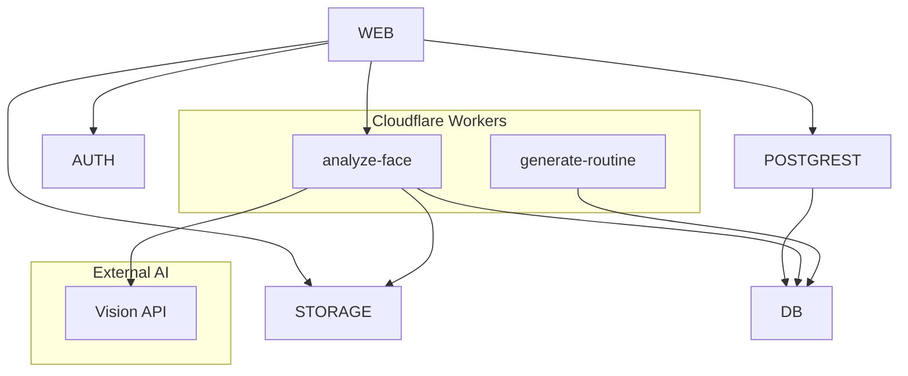

# ROAST - Backend Specification
## Supabase + Cloudflare Workers

> **Version**: 1.0 MVP  
> **Last Updated**: 2026-01-02

---

# 1. Architecture Overview

## 1.1 Backend Stack



## 1.2 Service Responsibilities

| Service | Purpose | Free Tier |
|---------|---------|-----------|
| **Supabase Auth** | User authentication | Unlimited users |
| **Supabase DB** | PostgreSQL database | 500MB |
| **Supabase Storage** | Image/file storage | 1GB |
| **Cloudflare Workers** | AI processing | 100K req/day |

---

# 2. Supabase Configuration

## 2.1 Database Schema (MVP)

### Core Tables

```sql
-- Users (auto-created on signup via trigger)
profiles (
  id UUID PRIMARY KEY,            -- Links to auth.users
  email TEXT,
  full_name TEXT,
  avatar_url TEXT,
  created_at TIMESTAMPTZ
)

-- Skin profile from onboarding quiz
skin_profiles (
  id UUID PRIMARY KEY,
  user_id UUID REFERENCES profiles,
  skin_type TEXT,                 -- 'oily', 'dry', 'combination', 'normal', 'sensitive'
  skin_concerns TEXT[],           -- ['acne', 'wrinkles', 'dark_spots']
  skin_goals TEXT[],              -- ['clear_skin', 'anti_aging', 'hydration']
  created_at TIMESTAMPTZ
)

-- Scan records
skin_scans (
  id UUID PRIMARY KEY,
  user_id UUID REFERENCES profiles,
  image_path TEXT,                -- Storage path
  scan_status TEXT,               -- 'pending', 'processing', 'completed', 'failed'
  glow_score INTEGER,             -- 0-100
  analysis_summary JSONB,         -- Full AI response
  created_at TIMESTAMPTZ
)

-- Scan usage tracking (quotas)
scan_usage (
  id UUID PRIMARY KEY,
  user_id UUID REFERENCES profiles,
  usage_date DATE,
  scans_used INTEGER DEFAULT 0,
  scans_limit INTEGER DEFAULT 5,  -- Based on plan
  UNIQUE(user_id, usage_date)
)

-- Routines
routines (
  id UUID PRIMARY KEY,
  user_id UUID REFERENCES profiles,
  routine_type TEXT,              -- 'AM' or 'PM'
  is_active BOOLEAN DEFAULT true,
  created_at TIMESTAMPTZ
)

-- Routine steps
routine_steps (
  id UUID PRIMARY KEY,
  routine_id UUID REFERENCES routines,
  product_id UUID REFERENCES products,
  step_order INTEGER,
  step_type TEXT,                 -- 'cleanser', 'toner', etc.
  instructions TEXT,
  created_at TIMESTAMPTZ
)

-- Product catalog
products (
  id UUID PRIMARY KEY,
  name TEXT,
  brand TEXT,
  category TEXT,
  ingredients TEXT[],
  image_url TEXT,
  metadata JSONB
)

-- Progress photos
progress_photos (
  id UUID PRIMARY KEY,
  user_id UUID REFERENCES profiles,
  image_path TEXT,
  taken_at TIMESTAMPTZ DEFAULT NOW()
)

-- Subscriptions
subscriptions (
  id UUID PRIMARY KEY,
  user_id UUID REFERENCES profiles,
  plan_type TEXT DEFAULT 'free',  -- 'free', 'pro', 'premium'
  status TEXT DEFAULT 'active',   -- 'active', 'cancelled'
  current_period_end TIMESTAMPTZ,
  payment_provider TEXT,          -- 'stripe', 'apple', 'google'
  provider_subscription_id TEXT,
  UNIQUE(user_id)
)
```

## 2.2 Row Level Security (RLS)

```sql
-- Enable RLS on all tables
ALTER TABLE profiles ENABLE ROW LEVEL SECURITY;
ALTER TABLE skin_profiles ENABLE ROW LEVEL SECURITY;
ALTER TABLE skin_scans ENABLE ROW LEVEL SECURITY;
ALTER TABLE scan_usage ENABLE ROW LEVEL SECURITY;
ALTER TABLE routines ENABLE ROW LEVEL SECURITY;
ALTER TABLE routine_steps ENABLE ROW LEVEL SECURITY;
ALTER TABLE progress_photos ENABLE ROW LEVEL SECURITY;
ALTER TABLE subscriptions ENABLE ROW LEVEL SECURITY;

-- Users can only access their own data
CREATE POLICY "Users read own data" ON profiles
  FOR SELECT USING (auth.uid() = id);

CREATE POLICY "Users read own skin_profiles" ON skin_profiles
  FOR ALL USING (auth.uid() = user_id);

CREATE POLICY "Users read own scans" ON skin_scans
  FOR ALL USING (auth.uid() = user_id);

CREATE POLICY "Users read own usage" ON scan_usage
  FOR ALL USING (auth.uid() = user_id);

CREATE POLICY "Users read own routines" ON routines
  FOR ALL USING (auth.uid() = user_id);

CREATE POLICY "Users read own progress" ON progress_photos
  FOR ALL USING (auth.uid() = user_id);

CREATE POLICY "Users read own subscription" ON subscriptions
  FOR SELECT USING (auth.uid() = user_id);

-- Products are public read
CREATE POLICY "Anyone can read products" ON products
  FOR SELECT TO authenticated USING (true);
```

## 2.3 Storage Buckets

| Bucket | Public | Max Size | Types | RLS |
|--------|--------|----------|-------|-----|
| `avatars` | Yes | 5MB | JPEG, PNG | User folder |
| `scans` | No | 10MB | JPEG, PNG | User folder |
| `progress` | No | 10MB | JPEG, PNG | User folder |

```sql
-- Storage RLS policies
CREATE POLICY "Users upload to own folder" ON storage.objects
  FOR INSERT WITH CHECK (
    bucket_id IN ('scans', 'progress', 'avatars')
    AND (storage.foldername(name))[1] = auth.uid()::text
  );

CREATE POLICY "Users read own files" ON storage.objects
  FOR SELECT USING (
    bucket_id IN ('scans', 'progress')
    AND (storage.foldername(name))[1] = auth.uid()::text
  );

CREATE POLICY "Avatars are public" ON storage.objects
  FOR SELECT USING (bucket_id = 'avatars');
```

## 2.4 Database Triggers

```sql
-- Auto-create profile on signup
CREATE OR REPLACE FUNCTION handle_new_user()
RETURNS TRIGGER AS $$
BEGIN
  INSERT INTO public.profiles (id, email, full_name, avatar_url)
  VALUES (
    NEW.id,
    NEW.email,
    NEW.raw_user_meta_data->>'full_name',
    NEW.raw_user_meta_data->>'avatar_url'
  );
  
  -- Create default free subscription
  INSERT INTO public.subscriptions (user_id, plan_type, status)
  VALUES (NEW.id, 'free', 'active');
  
  RETURN NEW;
END;
$$ LANGUAGE plpgsql SECURITY DEFINER;

CREATE TRIGGER on_auth_user_created
  AFTER INSERT ON auth.users
  FOR EACH ROW EXECUTE FUNCTION handle_new_user();
```

## 2.5 Authentication Setup

### Providers to Enable
1. **Email/Password** - Primary auth method
2. **Google OAuth** - Social login
3. **Apple OAuth** - Required for iOS

### Redirect URLs
```
# Development
http://localhost:5173/auth/callback

# Production (Web)
https://your-app.lovable.app/auth/callback

# Production (Mobile - Deep Link)
roast://auth/callback
```

---

# 3. Cloudflare Workers

## 3.1 Why Cloudflare Workers?

| Feature | Benefit |
|---------|---------|
| **Free Tier** | 100,000 requests/day |
| **Global Edge** | Low latency worldwide |
| **No Cold Starts** | Instant response |
| **AI Gateway** | Built-in AI provider access |

## 3.2 Worker: analyze-face

**Endpoint**: `POST /analyze-face`

### Request
```json
{
  "imagePath": "scans/{user_id}/{filename}.jpg",
  "userId": "uuid"
}
```

### Response
```json
{
  "success": true,
  "glow_score": 78,
  "analysis": {
    "acne": {
      "score": 85,
      "severity": "mild",
      "count": 3,
      "areas": ["forehead", "chin"]
    },
    "texture": {
      "score": 72,
      "description": "slightly uneven"
    },
    "hydration": {
      "score": 65,
      "level": "moderate"
    },
    "redness": {
      "score": 90,
      "areas": ["cheeks"]
    },
    "pores": {
      "score": 70,
      "visibility": "moderate"
    }
  },
  "recommendations": [
    "Your skin is thirsty. Buy a hydrating serum already.",
    "Exfoliate once a week. Your pores are basically screaming."
  ]
}
```

### Implementation

```typescript
// workers/analyze-face/src/index.ts

export interface Env {
  SUPABASE_URL: string;
  SUPABASE_SERVICE_KEY: string;
  AI_API_KEY: string;
}

export default {
  async fetch(request: Request, env: Env): Promise<Response> {
    // CORS headers
    if (request.method === 'OPTIONS') {
      return new Response(null, {
        headers: {
          'Access-Control-Allow-Origin': '*',
          'Access-Control-Allow-Methods': 'POST',
          'Access-Control-Allow-Headers': 'Content-Type, Authorization',
        },
      });
    }

    if (request.method !== 'POST') {
      return new Response('Method not allowed', { status: 405 });
    }

    try {
      const { imagePath, userId } = await request.json();
      
      // 1. Get image from Supabase Storage
      const imageUrl = `${env.SUPABASE_URL}/storage/v1/object/public/scans/${imagePath}`;
      const imageResponse = await fetch(imageUrl);
      const imageBlob = await imageResponse.blob();
      
      // 2. Convert to base64 for AI API
      const imageBase64 = await blobToBase64(imageBlob);
      
      // 3. Call AI Vision API for analysis
      const analysis = await analyzeWithAI(imageBase64, env.AI_API_KEY);
      
      // 4. Calculate Glow Score
      const glowScore = calculateGlowScore(analysis);
      
      // 5. Save results to Supabase
      await saveResults(env, userId, imagePath, glowScore, analysis);
      
      return new Response(JSON.stringify({
        success: true,
        glow_score: glowScore,
        analysis,
        recommendations: generateRecommendations(analysis),
      }), {
        headers: { 
          'Content-Type': 'application/json',
          'Access-Control-Allow-Origin': '*',
        },
      });
    } catch (error) {
      return new Response(JSON.stringify({ 
        success: false, 
        error: error.message 
      }), { 
        status: 500,
        headers: { 'Content-Type': 'application/json' },
      });
    }
  },
};

function calculateGlowScore(analysis: Analysis): number {
  // Weighted average of all metrics
  const weights = {
    acne: 0.25,
    texture: 0.20,
    hydration: 0.20,
    redness: 0.15,
    pores: 0.20,
  };
  
  let totalScore = 0;
  for (const [key, weight] of Object.entries(weights)) {
    totalScore += analysis[key].score * weight;
  }
  
  return Math.round(totalScore);
}
```

## 3.3 Worker: generate-routine

**Endpoint**: `POST /generate-routine`

### Request
```json
{
  "userId": "uuid",
  "routineType": "AM",
  "skinProfile": {
    "skin_type": "combination",
    "skin_concerns": ["acne", "large_pores"],
    "skin_goals": ["clear_skin"]
  }
}
```

### Response
```json
{
  "success": true,
  "routine": {
    "type": "AM",
    "steps": [
      {
        "order": 1,
        "type": "cleanser",
        "product_id": "uuid",
        "product_name": "CeraVe Gentle Cleanser",
        "instructions": "Apply to damp face, massage gently, rinse"
      },
      {
        "order": 2,
        "type": "toner",
        "product_id": "uuid",
        "product_name": "Niacinamide Toner",
        "instructions": "Apply with cotton pad or hands"
      }
    ]
  }
}
```

### Implementation Logic

```typescript
async function generateRoutine(skinProfile: SkinProfile, type: 'AM' | 'PM') {
  // 1. Define step order based on routine type
  const steps = type === 'AM' 
    ? ['cleanser', 'toner', 'serum', 'moisturizer', 'sunscreen']
    : ['cleanser', 'toner', 'treatment', 'serum', 'moisturizer'];
  
  // 2. For each step, find best product match
  const routine = [];
  for (const stepType of steps) {
    const product = await findBestProduct(stepType, skinProfile);
    routine.push({
      step_type: stepType,
      product_id: product.id,
      instructions: getInstructions(stepType),
    });
  }
  
  return routine;
}

function findBestProduct(stepType: string, profile: SkinProfile) {
  // Query products matching:
  // 1. Category = stepType
  // 2. Skin type compatibility
  // 3. Addresses concerns
  // 4. Supports goals
}
```

## 3.4 Cloudflare Worker Deployment

```bash
# Install Wrangler CLI
npm install -g wrangler

# Login
wrangler login

# Create project
wrangler init roast-ai-worker

# Configure wrangler.toml
```

```toml
# wrangler.toml
name = "roast-ai-worker"
main = "src/index.ts"
compatibility_date = "2024-01-01"

[vars]
ENVIRONMENT = "production"

# Secrets (set via CLI)
# wrangler secret put SUPABASE_URL
# wrangler secret put SUPABASE_SERVICE_KEY
# wrangler secret put AI_API_KEY
```

---

# 4. API Endpoints Summary

## 4.1 Supabase REST API

| Endpoint | Method | Description |
|----------|--------|-------------|
| `/auth/v1/signup` | POST | Create account |
| `/auth/v1/token?grant_type=password` | POST | Login |
| `/auth/v1/user` | GET | Get current user |
| `/rest/v1/profiles` | GET | Get profile |
| `/rest/v1/skin_profiles` | GET/POST | Manage skin profile |
| `/rest/v1/skin_scans` | GET/POST | Manage scans |
| `/rest/v1/scan_usage` | GET | Check quota |
| `/rest/v1/routines` | GET | Get routines |
| `/rest/v1/routine_steps` | GET | Get routine steps |
| `/rest/v1/progress_photos` | GET/POST | Manage progress |
| `/rest/v1/subscriptions` | GET | Get subscription |
| `/rest/v1/products` | GET | Browse products |

## 4.2 Cloudflare Worker Endpoints

| Endpoint | Method | Description |
|----------|--------|-------------|
| `workers.dev/analyze-face` | POST | AI face analysis |
| `workers.dev/generate-routine` | POST | Generate routine |

---

# 5. Webhooks

## 5.1 Stripe Webhook

**Endpoint**: Supabase Edge Function `/functions/v1/stripe-webhook`

### Events to Handle

| Event | Action |
|-------|--------|
| `checkout.session.completed` | Activate subscription |
| `customer.subscription.updated` | Update plan/status |
| `customer.subscription.deleted` | Downgrade to free |
| `invoice.payment_failed` | Mark as past_due |

### Implementation

```typescript
// supabase/functions/stripe-webhook/index.ts
import { serve } from 'https://deno.land/std/http/server.ts';
import Stripe from 'stripe';

const stripe = new Stripe(Deno.env.get('STRIPE_SECRET_KEY')!);

serve(async (req) => {
  const signature = req.headers.get('stripe-signature')!;
  const body = await req.text();
  
  const event = stripe.webhooks.constructEvent(
    body,
    signature,
    Deno.env.get('STRIPE_WEBHOOK_SECRET')!
  );
  
  switch (event.type) {
    case 'checkout.session.completed':
      await handleCheckoutComplete(event.data.object);
      break;
    case 'customer.subscription.updated':
      await handleSubscriptionUpdate(event.data.object);
      break;
    case 'customer.subscription.deleted':
      await handleSubscriptionDeleted(event.data.object);
      break;
  }
  
  return new Response(JSON.stringify({ received: true }));
});
```

---

# 6. Security Considerations

## 6.1 API Security

| Layer | Protection |
|-------|------------|
| **Authentication** | Supabase JWT tokens |
| **Authorization** | RLS policies |
| **Rate Limiting** | Cloudflare (auto) |
| **CORS** | Configured per worker |
| **Secrets** | Environment variables |

## 6.2 Data Privacy

- All user photos encrypted at rest
- Private storage buckets (RLS enforced)
- No third-party access to photos
- GDPR-ready data export/delete

---

# Document References

| Document | Purpose |
|----------|---------|
| [Workflow Spec](./WORKFLOW.md) | User flows and screens |
| [UI Spec](./UI.md) | Design system and styling |
| [Frontend Spec](./FRONTEND.md) | React implementation |
| [Technical Spec](./TECHNICAL.md) | Architecture overview |
