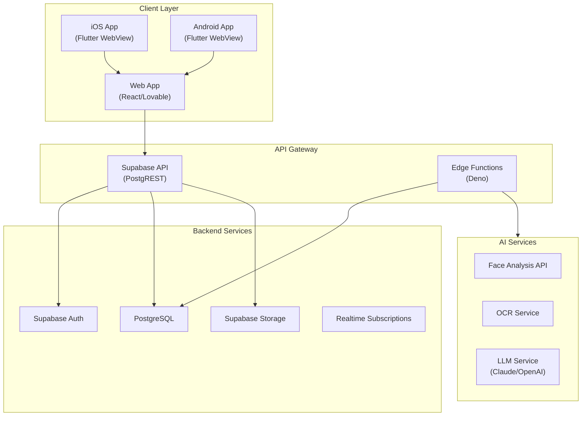
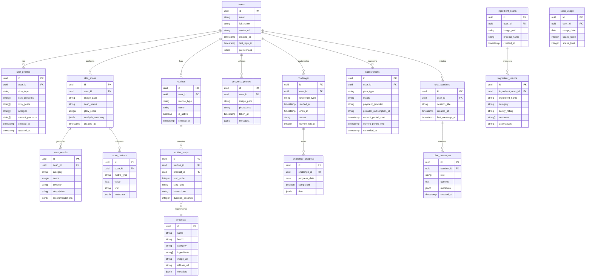
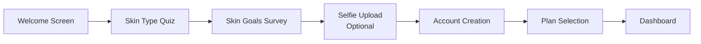
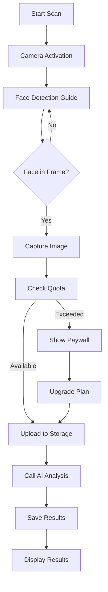
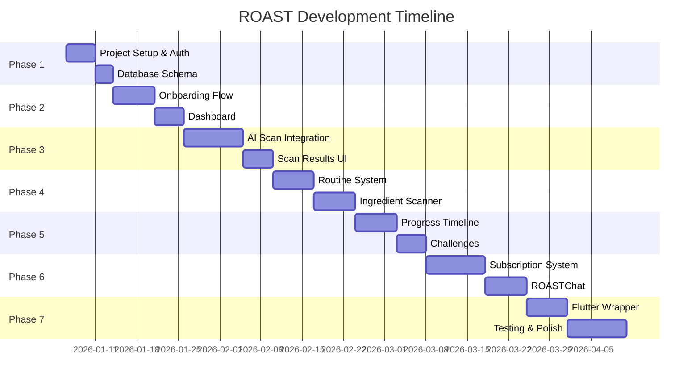

# ROAST - AI Skincare Companion
## Product Requirements Document (PRD)

---

# 1. Executive Summary

## 1.1 Product Vision
ROAST is a premium AI-powered skincare companion application designed to revolutionize personal skincare routines through advanced facial analysis, personalized recommendations, and continuous progress tracking. The app embodies Apple-style minimalism while delivering sophisticated AI capabilities.

## 1.2 Target Audience
- **Primary**: Health-conscious individuals aged 18-45 interested in skincare
- **Secondary**: Skincare enthusiasts seeking data-driven insights
- **Tertiary**: Users with specific skin concerns (acne, aging, sensitivity)

## 1.3 Platform Strategy
| Layer | Technology | Purpose |
|-------|------------|---------|
| **Frontend** | React (Lovable) | Web application development |
| **Mobile Wrapper** | Flutter | iOS & Android deployment |
| **Backend** | Supabase | Database, Auth, Storage, Edge Functions |
| **AI Services** | External APIs | Face analysis, OCR, LLM chat |

## 1.4 Monetization Model
| Plan | Price | Target Users |
|------|-------|--------------|
| **Free** | $0 | Casual users, trial experience |
| **Pro** | $9.99/mo | Regular users, full analysis |
| **Premium** | $19.99/mo | Power users, AI coaching |

---

# 2. Technical Architecture

## 2.1 System Architecture Overview



## 2.2 Technology Stack Details

### 2.2.1 Web Application (Lovable)
- **Framework**: React 18+
- **Styling**: Tailwind CSS with custom design tokens
- **State Management**: React Context + React Query
- **Routing**: React Router v6
- **Camera**: WebRTC API for face capture
- **Build Tool**: Vite

### 2.2.2 Flutter Mobile Wrapper
- **Flutter Version**: 3.16+
- **WebView**: flutter_inappwebview
- **Native Features**:
  - Camera access bridging
  - Push notifications (FCM)
  - Biometric authentication
  - In-app purchases (RevenueCat)
  - Deep linking

### 2.2.3 Supabase Backend
| Service | Usage |
|---------|-------|
| **Auth** | Email/password, Google OAuth, Apple Sign-In |
| **Database** | PostgreSQL with RLS policies |
| **Storage** | User photos, scan images, PDF reports |
| **Edge Functions** | AI proxy, webhook handlers, scheduled jobs |
| **Realtime** | Live progress updates, notifications |

---

# 3. Database Schema Design

## 3.1 Entity Relationship Diagram



## 3.2 Row Level Security (RLS) Policies

| Table | Policy | Description |
|-------|--------|-------------|
| `users` | Own data only | Users can read/update their own profile |
| `skin_profiles` | Authenticated user | Users access their own skin profile |
| `skin_scans` | Authenticated user | Users see their own scans |
| `routines` | Authenticated user | Users manage their own routines |
| `subscriptions` | Read-only for user | Users can view, admins can modify |
| `chat_messages` | Own sessions only | Users access their chat history |

## 3.3 Storage Buckets

| Bucket | Purpose | Access |
|--------|---------|--------|
| `avatars` | User profile photos | Public read, authenticated write |
| `scans` | Skin scan images | Private, user-only access |
| `progress` | Progress photos | Private, user-only access |
| `ingredients` | Ingredient scan images | Private, user-only access |
| `reports` | Generated PDF reports | Private, user-only access |

---

# 4. API Specifications

## 4.1 Supabase Edge Functions

### 4.1.1 AI Face Analysis
```
POST /functions/v1/analyze-face
```
| Parameter | Type | Required | Description |
|-----------|------|----------|-------------|
| `image_base64` | string | Yes | Base64 encoded face image |
| `user_id` | uuid | Yes | Current user ID |

**Response:**
```json
{
  "glow_score": 78,
  "analysis": {
    "acne": { "score": 85, "severity": "mild", "count": 3 },
    "texture": { "score": 72, "description": "slightly uneven" },
    "hydration": { "score": 65, "level": "moderate" },
    "redness": { "score": 90, "areas": ["cheeks"] },
    "wrinkles": { "score": 88, "severity": "minimal" },
    "dark_spots": { "score": 80, "count": 2 },
    "pores": { "score": 70, "visibility": "moderate" }
  },
  "recommendations": [...]
}
```

### 4.1.2 Ingredient OCR Scanner
```
POST /functions/v1/scan-ingredients
```
| Parameter | Type | Required | Description |
|-----------|------|----------|-------------|
| `image_base64` | string | Yes | Ingredient list image |
| `user_id` | uuid | Yes | Current user ID |

**Response:**
```json
{
  "ingredients": [
    {
      "name": "Sodium Lauryl Sulfate",
      "category": "surfactant",
      "safety_rating": "caution",
      "concerns": ["irritating", "drying"],
      "alternatives": ["Sodium Lauroyl Sarcosinate"]
    }
  ],
  "overall_rating": "moderate",
  "pore_clogging_count": 2,
  "irritant_count": 1
}
```

### 4.1.3 ROASTChat AI Assistant
```
POST /functions/v1/roast-chat
```
| Parameter | Type | Required | Description |
|-----------|------|----------|-------------|
| `session_id` | uuid | Yes | Chat session ID |
| `message` | string | Yes | User message |
| `context` | object | No | Skin history context |

### 4.1.4 Generate Routine
```
POST /functions/v1/generate-routine
```
| Parameter | Type | Required | Description |
|-----------|------|----------|-------------|
| `user_id` | uuid | Yes | User ID |
| `routine_type` | string | Yes | "AM" or "PM" |
| `skin_profile_id` | uuid | Yes | Skin profile reference |

### 4.1.5 Generate PDF Report
```
POST /functions/v1/generate-report
```
| Parameter | Type | Required | Description |
|-----------|------|----------|-------------|
| `user_id` | uuid | Yes | User ID |
| `type` | string | Yes | "weekly" or "monthly" |

## 4.2 Webhook Endpoints

| Endpoint | Trigger | Purpose |
|----------|---------|---------|
| `/webhooks/stripe` | Stripe events | Subscription management |
| `/webhooks/apple-iap` | Apple IAP | iOS subscription sync |
| `/webhooks/google-play` | Google Play | Android subscription sync |

---

# 5. Feature Specifications

## 5.1 Onboarding Flow



### 5.1.1 Skin Type Quiz
| Question | Options | Purpose |
|----------|---------|---------|
| How does your skin feel after cleansing? | Tight, Normal, Oily, Mixed | Determine skin type |
| How often do you experience breakouts? | Never, Rarely, Sometimes, Often | Acne tendency |
| Does your skin react to new products? | No, Sometimes, Yes | Sensitivity level |
| How visible are your pores? | Not visible, Slightly, Very | Pore assessment |

### 5.1.2 Skin Goals Selection
- Clear acne & blemishes
- Reduce fine lines & wrinkles
- Even skin tone
- Minimize pores
- Increase hydration
- Reduce redness
- Achieve natural glow

## 5.2 AI Skin Scan System

### 5.2.1 Scan Process Flow


### 5.2.2 Analysis Metrics
| Metric | Description | Score Range |
|--------|-------------|-------------|
| **Glow Score** | Overall skin health | 0-100 |
| **Acne Score** | Breakout severity | 0-100 (higher = better) |
| **Texture Score** | Skin smoothness | 0-100 |
| **Hydration Level** | Moisture assessment | 0-100 |
| **Redness Level** | Inflammation detection | 0-100 |
| **Wrinkle Score** | Fine lines analysis | 0-100 |
| **Pore Visibility** | Pore size assessment | 0-100 |
| **Dark Spots** | Hyperpigmentation count | Count + score |

### 5.2.3 Scan Limits by Plan
| Plan | Daily Limit | Monthly Limit | Full Report |
|------|-------------|---------------|-------------|
| Free | 1 | 5 | ❌ |
| Pro | Unlimited | Unlimited | ✅ |
| Premium | Unlimited | Unlimited | ✅ + PDF Export |

## 5.3 User Dashboard

### 5.3.1 Dashboard Components
| Component | Description | Data Source |
|-----------|-------------|-------------|
| **Glow Score Card** | Current overall score with trend | Latest scan |
| **Daily Tips** | AI-generated suggestions | LLM based on profile |
| **Streak Counter** | Consecutive days using app | Challenge progress |
| **Next Scan Available** | Countdown timer for free users | Quota system |
| **Quick Actions** | Scan, Routine, Progress buttons | Navigation |
| **Recent Activity** | Last 3 actions/scans | Activity log |

### 5.3.2 Dashboard Wireframe Reference
```
┌─────────────────────────────────────┐
│  ROAST                    👤 Profile │
├─────────────────────────────────────┤
│  ┌─────────────────────────────┐    │
│  │     GLOW SCORE: 78          │    │
│  │     ↑ 5 points from last    │    │
│  └─────────────────────────────┘    │
│                                      │
│  📝 Daily Tip:                       │
│  "Apply sunscreen even on cloudy    │
│   days to prevent UV damage"        │
│                                      │
│  🔥 12 Day Streak!                   │
│                                      │
│  ┌─────────┐ ┌─────────┐ ┌─────────┐│
│  │  SCAN   │ │ ROUTINE │ │PROGRESS ││
│  └─────────┘ └─────────┘ └─────────┘│
│                                      │
│  Recent Scans ──────────────────    │
│  • Jan 2, 2026 - Score: 78          │
│  • Dec 30, 2025 - Score: 73         │
└─────────────────────────────────────┘
```

## 5.4 Routine Generation

### 5.4.1 Routine Types
| Type | Time | Steps |
|------|------|-------|
| **AM Routine** | Morning | Cleanser → Toner → Serum → Moisturizer → SPF |
| **PM Routine** | Evening | Makeup Remover → Cleanser → Treatment → Moisturizer |

### 5.4.2 Step Details
Each routine step includes:
- Product type recommendation
- Specific product suggestions (with affiliate links)
- Application instructions
- Wait time between steps
- Why this step matters (educational)

### 5.4.3 Lock/Unlock System
| Plan | Access |
|------|--------|
| Free | View AM routine only, steps locked |
| Pro | Full AM/PM routines unlocked |
| Premium | Full routines + AI adjustments |

## 5.5 Ingredient Scanner

### 5.5.1 Ingredient Categories
| Category | Color Code | Examples |
|----------|------------|----------|
| **Actives** | 🟢 Green | Retinol, Vitamin C, Niacinamide |
| **Hydrators** | 🔵 Blue | Hyaluronic Acid, Glycerin |
| **Preservatives** | 🟡 Yellow | Phenoxyethanol, Parabens |
| **Irritants** | 🔴 Red | SLS, Fragrance, Alcohol |
| **Pore-Clogging** | 🟠 Orange | Coconut Oil, Isopropyl Myristate |

### 5.5.2 Alternative Suggestions
For each flagged ingredient, provide:
- Safer alternative ingredient
- Products containing the alternative
- Affiliate purchase links

## 5.6 Progress Timeline

### 5.6.1 Features
| Feature | Description | Plan |
|---------|-------------|------|
| **Before/After Slider** | Compare two photos | All |
| **7-Day Timelapse** | Week progress animation | Pro+ |
| **30-Day Timelapse** | Month progress animation | Pro+ |
| **Score Trend Graph** | Glow score over time | All |
| **Metric Comparison** | Individual metrics over time | Pro+ |

## 5.7 Challenges & Gamification

### 5.7.1 Available Challenges
| Challenge | Duration | Description | Reward |
|-----------|----------|-------------|--------|
| **Glow-7** | 7 days | Complete routine daily | 🏆 Badge |
| **Acne Reset 30** | 30 days | Follow anti-acne routine | 🏆 Badge + Report |
| **Texture Smooth 14** | 14 days | Exfoliation + hydration focus | 🏆 Badge |
| **Hydration Hero** | 21 days | Track water + skincare | 🏆 Badge |

### 5.7.2 Gamification Elements
- Daily check-in streaks
- Achievement badges
- Leaderboard (optional social feature)
- XP points system
- Level progression

## 5.8 ROASTChat (Premium AI Coach)

### 5.8.1 Capabilities
| Feature | Description |
|---------|-------------|
| **Skin History Analysis** | Access all past scans and progress |
| **Routine Adjustment** | Suggest changes based on progress |
| **Product Recommendations** | Personalized product advice |
| **Q&A** | Answer skincare questions |
| **Weekly Summary** | Generate PDF summary reports |

### 5.8.2 Context Injection
The AI receives:
- User's skin profile
- Last 10 scan results
- Current routine
- Active challenges
- Previous chat history

---

# 6. AI Integration Specifications

## 6.1 Face Analysis Service

### 6.1.1 Recommended Providers
| Provider | Pros | Cons | Cost Estimate |
|----------|------|------|---------------|
| **AWS Rekognition** | Accurate, scalable | Complex setup | $1 per 1000 images |
| **Google Cloud Vision** | Good accuracy | Limited skin metrics | $1.50 per 1000 |
| **Face++** | Skin analysis specific | China-based | $0.50 per 1000 |
| **Custom ML Model** | Full control | Requires training data | Development cost |

### 6.1.2 Recommended Approach
Use a hybrid approach:
1. **Face Detection**: AWS Rekognition or MediaPipe (client-side)
2. **Skin Analysis**: Custom fine-tuned vision model or Face++
3. **Additional Processing**: Edge function to normalize and score

## 6.2 OCR Service

### 6.2.1 Recommended Providers
| Provider | Best For | Cost |
|----------|----------|------|
| **Google Cloud Vision OCR** | General text extraction | $1.50/1000 |
| **AWS Textract** | Structured data | $1.50/1000 |
| **Tesseract (Self-hosted)** | Cost savings | Free (compute cost) |

### 6.2.2 Post-Processing Pipeline
```
Image → OCR → Text Extraction → Ingredient Parsing → 
Database Lookup → Safety Rating → Alternative Matching
```

## 6.3 LLM Integration (ROASTChat)

### 6.3.1 Provider Options
| Provider | Model | Best For | Cost |
|----------|-------|----------|------|
| **Anthropic Claude** | claude-3-sonnet | Nuanced advice | $3/1M input tokens |
| **OpenAI** | gpt-4-turbo | General chat | $10/1M input tokens |
| **OpenAI** | gpt-3.5-turbo | Budget option | $0.50/1M tokens |

### 6.3.2 System Prompt Template
```
You are ROAST, an expert AI skincare coach. You have access to 
the user's complete skin profile, scan history, and current routine.

User Profile:
- Skin Type: {skin_type}
- Concerns: {concerns}
- Goals: {goals}
- Allergies: {allergies}

Recent Scan Results:
{scan_history}

Current Routine:
{routine}

Guidelines:
1. Provide evidence-based skincare advice
2. Be encouraging but honest
3. Recommend products within budget when asked
4. Never diagnose medical conditions
5. Suggest consulting a dermatologist for serious concerns
```

---

# 7. Subscription & Paywall System

## 7.1 Feature Matrix

| Feature | Free | Pro ($9.99) | Premium ($19.99) |
|---------|------|-------------|------------------|
| Skin scans | 5/month | Unlimited | Unlimited |
| Basic analysis | ✅ | ✅ | ✅ |
| Full report | ❌ | ✅ | ✅ |
| AM Routine | Preview | ✅ | ✅ |
| PM Routine | ❌ | ✅ | ✅ |
| Ingredient Scanner | 3/month | 20/month | Unlimited |
| Progress Timeline | Basic | Full | Full + Export |
| Challenges | 1 active | Unlimited | Unlimited |
| ROASTChat | ❌ | ❌ | ✅ |
| Weekly PDF Reports | ❌ | ❌ | ✅ |
| Priority Support | ❌ | ❌ | ✅ |

## 7.2 Paywall Triggers
| Trigger | Action |
|---------|--------|
| Scan limit reached | Show upgrade modal |
| Access locked feature | Show feature-specific paywall |
| View full report | Soft paywall with blur preview |
| Try ROASTChat | Premium paywall |
| Export progress photos | Pro+ paywall |

## 7.3 Payment Integration

### 7.3.1 Web (Stripe)
- Stripe Checkout for web subscriptions
- Webhook handlers for subscription events
- Customer portal for management

### 7.3.2 Mobile (RevenueCat)
- RevenueCat SDK in Flutter wrapper
- Apple App Store subscriptions
- Google Play subscriptions
- Cross-platform entitlement sync

---

# 8. Security & Compliance

## 8.1 Data Privacy

### 8.1.1 GDPR Compliance
| Requirement | Implementation |
|-------------|----------------|
| Right to access | Export user data API |
| Right to delete | Account deletion with cascade |
| Consent management | Onboarding consent flow |
| Data portability | JSON export function |

### 8.1.2 Photo Privacy
- All photos encrypted at rest
- User-only access via RLS
- Optional auto-delete after X days
- No third-party sharing without consent

## 8.2 Security Measures

| Layer | Security Measure |
|-------|------------------|
| **Transport** | HTTPS/TLS 1.3 everywhere |
| **Authentication** | Supabase Auth with MFA option |
| **Authorization** | Row Level Security (RLS) |
| **Data** | Encryption at rest (AES-256) |
| **API** | Rate limiting on Edge Functions |
| **Secrets** | Supabase Vault for API keys |

## 8.3 HIPAA Considerations
> [!IMPORTANT]
> While ROAST is not a medical device, if expanding to work with dermatologists or healthcare providers, HIPAA compliance will be required.

---

# 9. Development Timeline

## 9.1 Phase Overview



## 9.2 Detailed Phase Breakdown

### Phase 1: Foundation (Week 1)
- [ ] Supabase project setup
- [ ] Database schema migration
- [ ] Authentication (Email, Google, Apple)
- [ ] Storage buckets configuration
- [ ] RLS policies implementation

### Phase 2: Onboarding & Dashboard (Week 2-3)
- [ ] Welcome screens
- [ ] Skin type quiz
- [ ] Goals survey
- [ ] Optional selfie upload
- [ ] Account creation flow
- [ ] Main dashboard UI
- [ ] Navigation structure

### Phase 3: AI Skin Scan (Week 4-5)
- [ ] Camera integration (WebRTC)
- [ ] Face detection overlay
- [ ] Image capture and upload
- [ ] AI analysis Edge Function
- [ ] Results display UI
- [ ] Scan history
- [ ] Quota system implementation

### Phase 4: Routines & Ingredients (Week 6-7)
- [ ] Routine generation Edge Function
- [ ] AM/PM routine display
- [ ] Step-by-step view
- [ ] Product recommendations
- [ ] Ingredient scanner camera
- [ ] OCR integration
- [ ] Ingredient analysis display

### Phase 5: Progress & Gamification (Week 8-9)
- [ ] Progress photo capture
- [ ] Before/after slider
- [ ] Timelapse generation
- [ ] Score trend charts
- [ ] Challenge system
- [ ] Streak tracking
- [ ] Badge system

### Phase 6: Subscriptions & Premium (Week 10-11)
- [ ] Stripe integration (web)
- [ ] Paywall components
- [ ] Feature gating logic
- [ ] ROASTChat interface
- [ ] LLM integration
- [ ] PDF report generation

### Phase 7: Mobile & Polish (Week 12-14)
- [ ] Flutter WebView wrapper
- [ ] RevenueCat integration
- [ ] Push notifications
- [ ] Deep linking
- [ ] Performance optimization
- [ ] Bug fixes
- [ ] App Store preparation

## 9.3 Estimated Timeline Summary

| Phase | Duration | Effort |
|-------|----------|--------|
| Phase 1: Foundation | 1 week | Setup |
| Phase 2: Onboarding & Dashboard | 2 weeks | Core UI |
| Phase 3: AI Skin Scan | 2 weeks | AI Integration |
| Phase 4: Routines & Ingredients | 2 weeks | Feature Development |
| Phase 5: Progress & Gamification | 2 weeks | Feature Development |
| Phase 6: Subscriptions & Premium | 2 weeks | Monetization |
| Phase 7: Mobile & Polish | 3 weeks | Mobile + QA |
| **Total** | **14 weeks** | ~3.5 months |

---

# 10. Success Metrics

## 10.1 Key Performance Indicators

| Metric | Target | Measurement |
|--------|--------|-------------|
| **DAU/MAU Ratio** | > 30% | Analytics |
| **Free → Pro Conversion** | > 5% | Subscription analytics |
| **Pro → Premium Upgrade** | > 15% | Subscription analytics |
| **User Retention (D7)** | > 40% | Cohort analysis |
| **Average Session Duration** | > 3 min | Analytics |
| **Scans per User (weekly)** | > 2 | Database metrics |
| **App Store Rating** | > 4.5 | Store reviews |

---

# 11. User Review Required

> [!IMPORTANT]
> The following decisions require your input before proceeding:

1. **AI Provider Selection**: Which face analysis provider do you prefer?
   - AWS Rekognition + custom scoring
   - Face++ (specialized skin analysis)
   - Custom ML model (requires training data)

2. **LLM Provider for ROASTChat**: 
   - Claude (recommended for nuanced advice)
   - OpenAI GPT-4
   - Budget: GPT-3.5-turbo

3. **Subscription Prices**: Are Free/$9.99/$19.99 confirmed?

4. **Timeline**: 14 weeks is the estimate - is this acceptable?

5. **Feature Priority**: Should any features be moved to post-MVP?

---

# 12. Appendix

## 12.1 Glossary

| Term | Definition |
|------|------------|
| **Glow Score** | Proprietary 0-100 composite skin health metric |
| **RLS** | Row Level Security - Supabase access control |
| **Edge Function** | Serverless function running on Supabase Edge |
| **WebView** | Browser component embedded in native app |

## 12.2 References

- [Supabase Documentation](https://supabase.com/docs)
- [Flutter WebView Documentation](https://pub.dev/packages/webview_flutter)
- [RevenueCat Documentation](https://docs.revenuecat.com)
- [Stripe Subscriptions](https://stripe.com/docs/billing/subscriptions)
