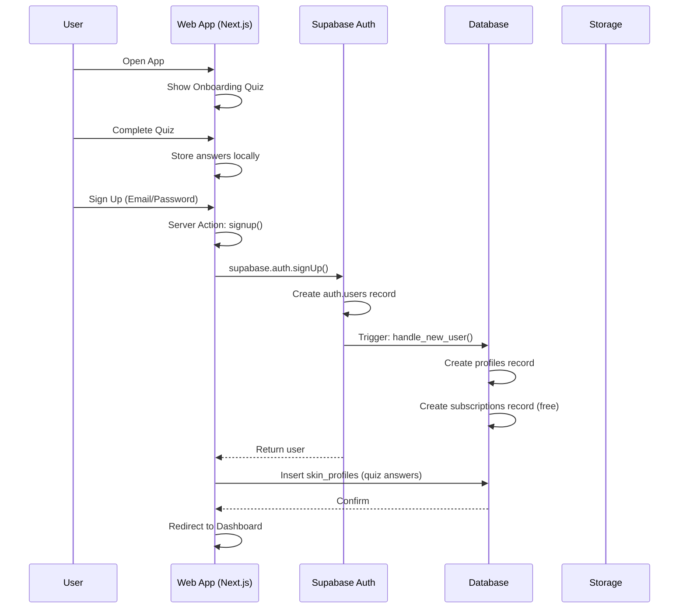
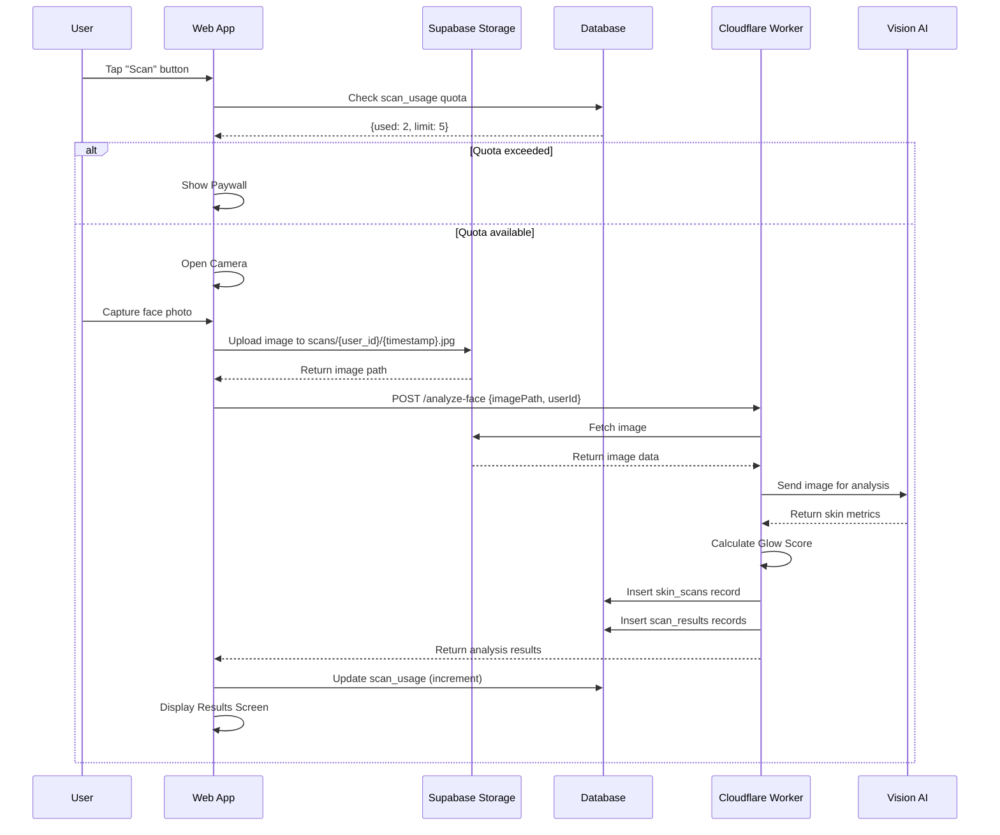
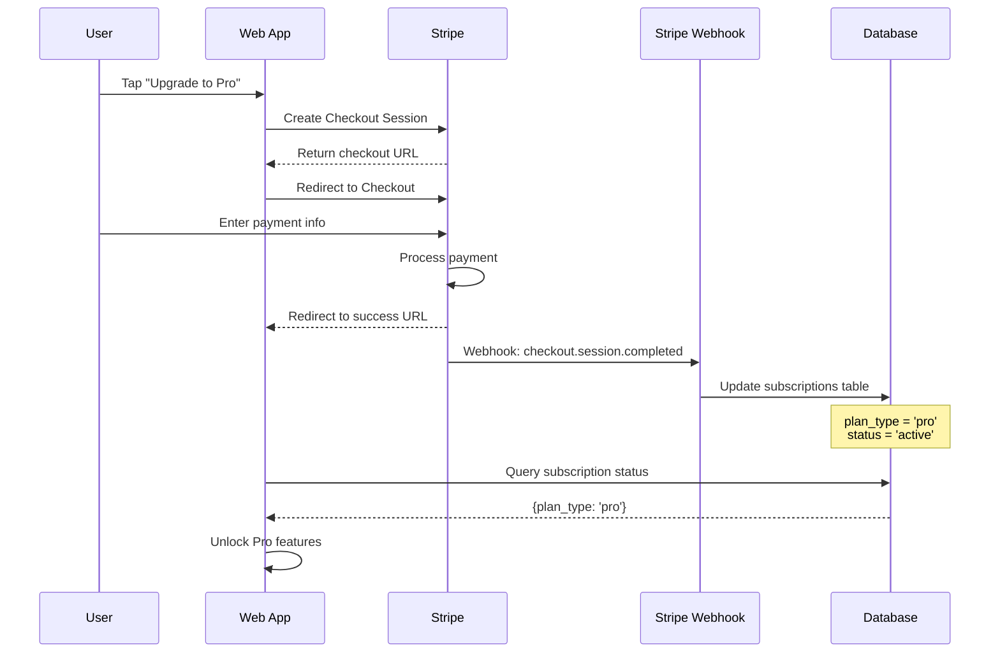

# ROAST - Technical Specification
## System Architecture & Integration Guide

> **Version**: 1.0 MVP  
> **Last Updated**: 2026-01-02

---

# 1. System Architecture

## 1.1 High-Level Architecture

```mermaid
flowchart TB
    subgraph Users ["Users"]
        IOS["iOS App"]
        AND["Android App"]
        WEB["Web Browser"]
    end
    
    subgraph Mobile ["Flutter Wrapper"]
        WEBVIEW["WebView"]
        NATIVE["Native Bridge"]
        IAP["In-App Purchase"]
        CAMERA["Camera"]
        PUSH["Push Notifications"]
    end
    
    subgraph WebApp ["Web Application (Lovable)"]
        REACT["React SPA"]
        ROUTER["React Router"]
        STATE["Zustand Store"]
        QUERY["TanStack Query"]
    end
    
    subgraph Backend ["Supabase"]
        AUTH["Auth Service"]
        DB[(PostgreSQL)]
        STORAGE["Object Storage"]
        REALTIME["Realtime"]
    end
    
    subgraph AI ["Cloudflare Workers"]
        FACE["Face Analysis"]
        ROUTINE["Routine Generator"]
    end
    
    subgraph External ["External Services"]
        VISION["Vision AI API"]
    end
        STRIPE["Stripe"]
        APPLE["Apple IAP"]
        GOOGLE["Google Play"]
    end
    
    IOS --> WEBVIEW
    AND --> WEBVIEW
    WEBVIEW --> REACT
    WEB --> REACT
    
    REACT --> AUTH
    REACT --> DB
    REACT --> STORAGE
    REACT --> FACE
    
    FACE --> VISION
    FACE --> DB
    
    NATIVE --> CAMERA
    NATIVE --> IAP
    IAP --> APPLE
    IAP --> GOOGLE
    
    STRIPE --> DB
```

## 1.2 Technology Decisions

| Component | Choice | Rationale |
|-----------|--------|-----------|
| **Web Framework** | Next.js (App Router) | SEO, Server Components, SSR |
| **Mobile** | Responsive Web (PWA) | Single codebase, accessible everywhere |
| **Database** | Supabase PostgreSQL | Free tier, real-time, auth included |
| **AI Processing** | Cloudflare Workers | Free tier (100k/day), edge deployment |
| **Payments** | Stripe | Easy integration, robust |

---

# 2. Data Flow Diagrams

## 2.1 User Registration Flow



## 2.2 Skin Scan Flow



## 2.3 Subscription Flow (Stripe)



---

# 3. Integration Specifications

## 3.1 Supabase Client Setup (Next.js App Router)

```typescript
// src/lib/supabase/client.ts (Browser Client)
import { createBrowserClient } from '@supabase/ssr'

export function createClient() {
  return createBrowserClient(
    process.env.NEXT_PUBLIC_SUPABASE_URL!,
    process.env.NEXT_PUBLIC_SUPABASE_ANON_KEY!
  )
}

// src/lib/supabase/server.ts (Server Client)
import { createServerClient } from '@supabase/ssr'
import { cookies } from 'next/headers'

export async function createClient() {
  const cookieStore = await cookies()

  return createServerClient(
    process.env.NEXT_PUBLIC_SUPABASE_URL!,
    process.env.NEXT_PUBLIC_SUPABASE_ANON_KEY!,
    {
      cookies: {
        getAll() {
          return cookieStore.getAll()
        },
        setAll(cookiesToSet) {
          try {
            cookiesToSet.forEach(({ name, value, options }) =>
              cookieStore.set(name, value, options)
            )
          } catch {
            // Ignored in Server Components
          }
        },
      },
    }
  )
}
```

## 3.2 Cloudflare Worker Communication

```typescript
// lib/ai.ts
const WORKER_BASE_URL = process.env.NEXT_PUBLIC_CLOUDFLARE_WORKER_URL;

export async function analyzeFace(imagePath: string, userId: string) {
  // Implementation...
}
```

---

# 4. Environment Configuration

## 4.1 Environment Variables (.env.local)

```env
# Supabase
NEXT_PUBLIC_SUPABASE_URL=https://xxxxx.supabase.co
NEXT_PUBLIC_SUPABASE_ANON_KEY=eyJhbGciOiJIUzI1NiIsInR5cCI6IkpXVCJ9...

# Cloudflare Worker
NEXT_PUBLIC_CLOUDFLARE_WORKER_URL=https://roast-ai-worker.your-subdomain.workers.dev

# Stripe
NEXT_PUBLIC_STRIPE_PUBLISHABLE_KEY=pk_test_...
STRIPE_SECRET_KEY=sk_test_...
STRIPE_WEBHOOK_SECRET=whsec_...
```

## 4.2 Cloudflare Worker Secrets

```bash
# Set via Wrangler CLI
wrangler secret put SUPABASE_URL
wrangler secret put SUPABASE_SERVICE_KEY
wrangler secret put AI_API_KEY
```

---

# 5. TypeScript Types

## 5.1 Database Types

```typescript
// types/database.ts

export interface Database {
  public: {
    Tables: {
      profiles: {
        Row: {
          id: string;
          email: string | null;
          full_name: string | null;
          avatar_url: string | null;
          created_at: string;
        };
        Insert: Omit<Profile, 'id' | 'created_at'>;
        Update: Partial<Profile>;
      };
      
      skin_profiles: {
        Row: {
          id: string;
          user_id: string;
          skin_type: 'oily' | 'dry' | 'combination' | 'normal' | 'sensitive';
          skin_concerns: string[];
          skin_goals: string[];
          created_at: string;
        };
      };
      
      skin_scans: {
        Row: {
          id: string;
          user_id: string;
          image_path: string;
          scan_status: 'pending' | 'processing' | 'completed' | 'failed';
          glow_score: number;
          analysis_summary: ScanAnalysis;
          created_at: string;
        };
      };
      
      scan_usage: {
        Row: {
          id: string;
          user_id: string;
          usage_date: string;
          scans_used: number;
          scans_limit: number;
        };
      };
      
      routines: {
        Row: {
          id: string;
          user_id: string;
          routine_type: 'AM' | 'PM';
          is_active: boolean;
          created_at: string;
        };
      };
      
      routine_steps: {
        Row: {
          id: string;
          routine_id: string;
          product_id: string;
          step_order: number;
          step_type: string;
          instructions: string;
        };
      };
      
      products: {
        Row: {
          id: string;
          name: string;
          brand: string;
          category: string;
          ingredients: string[];
          image_url: string | null;
          metadata: Record<string, any>;
        };
      };
      
      subscriptions: {
        Row: {
          id: string;
          user_id: string;
          plan_type: 'free' | 'pro' | 'premium';
          status: 'active' | 'cancelled' | 'past_due';
          current_period_end: string | null;
          payment_provider: 'stripe' | 'apple' | 'google' | null;
        };
      };
    };
  };
}
```

## 5.2 API Types

```typescript
// types/api.ts

export interface ScanAnalysis {
  acne: MetricResult;
  texture: MetricResult;
  hydration: MetricResult;
  redness: MetricResult;
  pores: MetricResult;
}

export interface MetricResult {
  score: number;         // 0-100
  severity?: string;     // 'minimal' | 'mild' | 'moderate' | 'severe'
  description?: string;
  areas?: string[];
  count?: number;
}

export interface ScanResult {
  success: boolean;
  glow_score: number;
  analysis: ScanAnalysis;
  recommendations: string[];
}

export interface RoutineResult {
  success: boolean;
  routine: {
    type: 'AM' | 'PM';
    steps: RoutineStepData[];
  };
}

export interface RoutineStepData {
  order: number;
  type: string;
  product_id: string;
  product_name: string;
  instructions: string;
}
```

---

# 6. Error Handling

## 6.1 Error Types

```typescript
// lib/errors.ts

export class AppError extends Error {
  constructor(
    message: string,
    public code: string,
    public statusCode: number = 500
  ) {
    super(message);
    this.name = 'AppError';
  }
}

export class AuthError extends AppError {
  constructor(message: string) {
    super(message, 'AUTH_ERROR', 401);
    this.name = 'AuthError';
  }
}

export class QuotaExceededError extends AppError {
  constructor() {
    super('Scan quota exceeded', 'QUOTA_EXCEEDED', 403);
    this.name = 'QuotaExceededError';
  }
}

export class ScanFailedError extends AppError {
  constructor(message: string) {
    super(message, 'SCAN_FAILED', 500);
    this.name = 'ScanFailedError';
  }
}
```

## 6.2 Error Handling in Components

```typescript
// hooks/useScan.ts

export function useScan() {
  const { toast } = useToast();
  
  const performScan = async (imageBlob: Blob) => {
    try {
      // Check quota first
      const quota = await checkQuota();
      if (!quota.canScan) {
        throw new QuotaExceededError();
      }
      
      // Upload and analyze
      const imagePath = await uploadImage(imageBlob);
      const result = await analyzeFace(imagePath);
      
      return result;
    } catch (error) {
      if (error instanceof QuotaExceededError) {
        showPaywall('scan_limit');
      } else if (error instanceof ScanFailedError) {
        toast({
          title: 'Scan Failed',
          description: 'Please try again in good lighting.',
          variant: 'destructive',
        });
      } else {
        toast({
          title: 'Something went wrong',
          description: 'Please try again later.',
          variant: 'destructive',
        });
      }
      throw error;
    }
  };
  
  return { performScan };
}
```

---

# 7. Performance Optimization

## 7.1 Image Optimization

```typescript
// lib/image-utils.ts

export async function compressImage(
  blob: Blob, 
  maxWidth: number = 1024,
  quality: number = 0.8
): Promise<Blob> {
  return new Promise((resolve) => {
    const img = new Image();
    img.src = URL.createObjectURL(blob);
    
    img.onload = () => {
      const canvas = document.createElement('canvas');
      const ratio = Math.min(maxWidth / img.width, 1);
      canvas.width = img.width * ratio;
      canvas.height = img.height * ratio;
      
      const ctx = canvas.getContext('2d')!;
      ctx.drawImage(img, 0, 0, canvas.width, canvas.height);
      
      canvas.toBlob(
        (compressedBlob) => resolve(compressedBlob!),
        'image/jpeg',
        quality
      );
    };
  });
}
```

## 7.2 Caching Strategy

```typescript
// Query caching with TanStack Query
const queryClient = new QueryClient({
  defaultOptions: {
    queries: {
      staleTime: 5 * 60 * 1000,      // 5 minutes
      cacheTime: 30 * 60 * 1000,     // 30 minutes
      refetchOnWindowFocus: false,
    },
  },
});

// Specific cache times
const CACHE_TIMES = {
  profile: 10 * 60 * 1000,           // 10 minutes
  subscription: 5 * 60 * 1000,       // 5 minutes (check often)
  products: 60 * 60 * 1000,          // 1 hour (rarely changes)
  scans: 2 * 60 * 1000,              // 2 minutes
};
```

---

# 8. Testing Strategy

## 8.1 Test Types

| Type | Tool | Scope |
|------|------|-------|
| Unit | Vitest | Functions, utilities |
| Component | Testing Library | React components |
| Integration | Playwright | User flows |
| E2E | Playwright | Full app flows |

## 8.2 Test Structure

```
tests/
├── unit/
│   ├── utils.test.ts
│   └── scoring.test.ts
├── components/
│   ├── Button.test.tsx
│   └── GlowScoreCard.test.tsx
├── integration/
│   ├── auth.test.ts
│   └── scan.test.ts
└── e2e/
    ├── onboarding.spec.ts
    └── scan-flow.spec.ts
```

---

# 9. Deployment

## 9.1 Web App (Lovable)

```bash
# Lovable auto-deploys on git push
git push origin main
```

## 9.2 Cloudflare Workers

```bash
# Deploy all workers
wrangler deploy

# Deploy specific worker
cd workers/analyze-face
wrangler deploy
```

## 9.3 Flutter App

```bash
# Build iOS
flutter build ios --release

# Build Android
flutter build appbundle --release
```

---

# 10. Monitoring & Analytics

## 10.1 Error Tracking

```typescript
// lib/monitoring.ts
import * as Sentry from '@sentry/react';

Sentry.init({
  dsn: import.meta.env.VITE_SENTRY_DSN,
  environment: import.meta.env.MODE,
  integrations: [new Sentry.BrowserTracing()],
  tracesSampleRate: 0.1,
});
```

## 10.2 Analytics Events

| Event | Properties |
|-------|------------|
| `scan_started` | `user_id` |
| `scan_completed` | `user_id`, `glow_score`, `duration_ms` |
| `scan_failed` | `user_id`, `error_code` |
| `routine_viewed` | `user_id`, `routine_type` |
| `paywall_shown` | `user_id`, `trigger` |
| `subscription_started` | `user_id`, `plan_type` |

---

# Document References

| Document | Purpose |
|----------|---------|
| [Workflow Spec](./WORKFLOW.md) | User flows and screens |
| [UI Spec](./UI.md) | Design system and styling |
| [Frontend Spec](./FRONTEND.md) | React implementation |
| [Backend Spec](./BACKEND.md) | Supabase + Workers |
